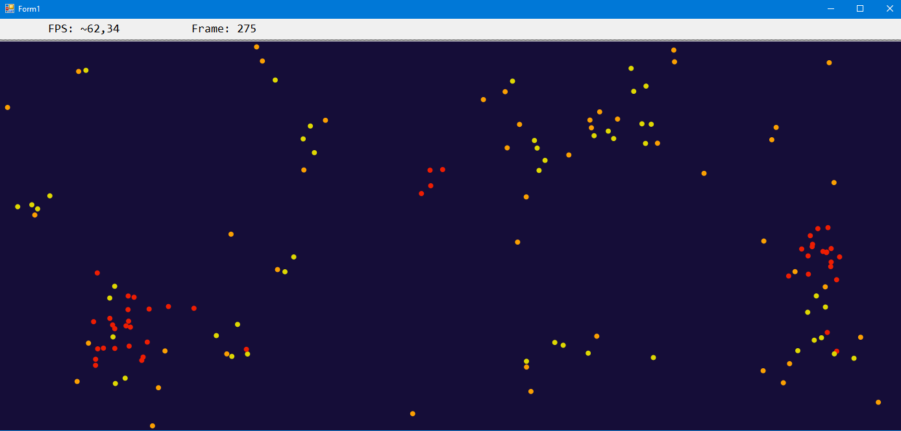

# Particles
Проект в духе клеточных автоматов с прокаченной физикой частиц на Windows Forms (C#). Упор на красивую плавную физику, планировалось создать множество правил для частиц. Сейчас заброшен.

## Используемые технологии
- C#
- Windows Forms (WinForms)
- Visual Studio

## Что сделано?
- [x] Приятная анимация
- [x] Частицы взаимодействуют несколькими типами сил
- [x] 60 FPS с 150 частицами (на среднем железе)
- [x] Счетчик FPS и числа кадров за всю сессию
- [x] Оптимизация через распараллеливание

## Скриншоты

## Статус проекта
Проект заброшен. Состояние черновое, остались отголоски экспериментов с тикерами и оптимизацией. Тем не менее, он демонстрирует работу с графикой и физикой на C# + WinForms (и мою любовь к математике).
